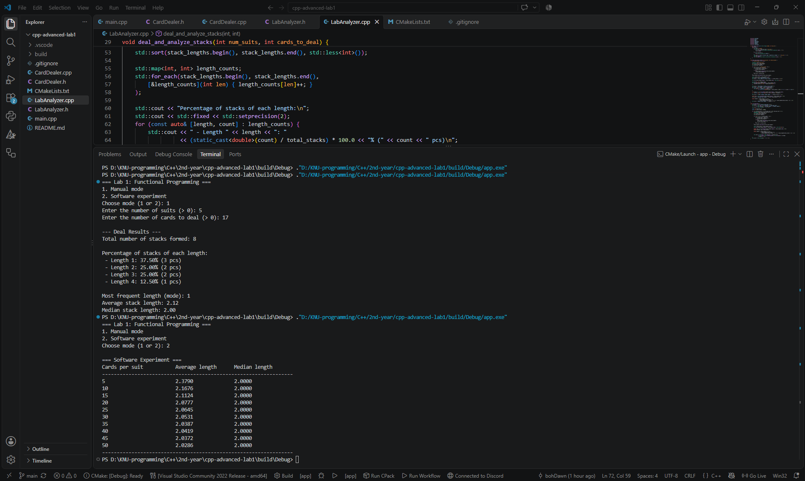
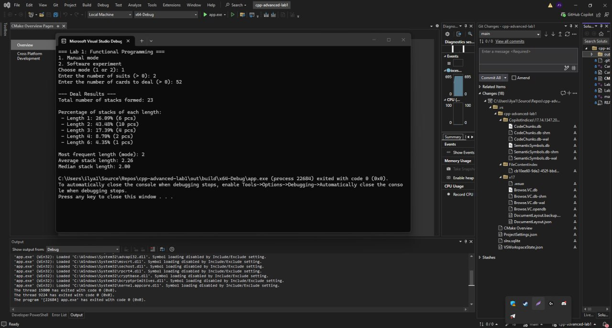
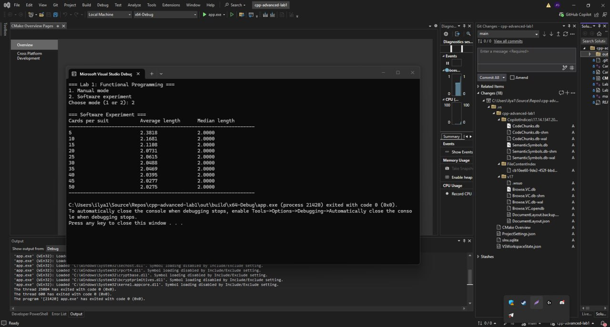

# Програмний проект №1: Функціональне програмування. Задача №5

**Автори:** Грабовський Богдан, Зінов'єв Ілля.  
Факультет комп'ютерних наук та кібернетики КНУ імені Тараса Шевченка, спеціальність «Комп'ютерні науки», освітня програма «Інформатика».  
Дисципліна: «Програмування мовою C++. Додаткові розділи».

## Суть проєкту

Програма моделює роздачу колоди карт для дослідження довжини монотонних стопок. Алгоритм формує стопки за правилом: поточна стопка продовжується, поки кожна наступна витягнута карта **більша або дорівнює** попередній за номіналом. Якщо випадає строго менша карта — починається нова стопка. Програма має два режими роботи: ручний (для виведення статистики по одній роздачі, включаючи моду, медіану та середнє) та програмний експеримент (для дослідження асимптотичної залежності довжини стопки від об'єму колоди).

## Збірка та запуск (CMake)

Проєкт використовує систему збірки CMake (версії 3.20+) та вимагає компілятора з підтримкою стандарту **C++23** (MSVC із прапорцем `/std:c++latest` або GCC/Clang із `-std=c++23`).

### Через термінал
1. Перейдіть до кореневої теки проєкту.
2. Зберіть проєкт за допомогою команд:
   ```bash
   mkdir build
   cd build
   cmake .. -DCMAKE_BUILD_TYPE=Release
   cmake --build .
   ```
3. Запустіть програму:
   * Windows: `.\Debug\app.exe` (або `.\Release\app.exe`)
   * Linux/macOS: `./app`

### Через IDE
* **VS Code:** Відкрийте теку проєкту, дочекайтеся ініціалізації розширення CMake Tools і натисніть кнопку `Build` на нижній панелі. Запуск здійснюється через інтегрований термінал.
* **Visual Studio 2022:** `File -> Open -> Folder...` і оберіть теку проєкту. Збирайте через `Build -> Build All`.

## Використані засоби C++

* **Власний клас функціональних об'єктів:** `CardDealer` використовує перевантажений `operator()` для генерації та видачі карт.
* **Three-way comparison:** Логіка порівняння карт реалізована виключно через оператор C++20/23 `std::strong_ordering operator<=>` у структурі `Card`.
* **Анонімні функції (лямбди):** Використовуються у комбінації з `std::for_each` для елегантного заповнення словника частот та в алгоритмах пошуку.
* **STL Алгоритми:** Задіяно `<algorithm>` (`std::ranges::shuffle`, `std::sort`, `std::for_each`, `std::max_element`) та `<numeric>` (`std::accumulate`) для відмови від ручних циклів при агрегації даних.

## Алгоритм та прийняті рішення

* **Оптимізація пам'яті:** При симуляції на мільйони роздач програма не зберігає довжину кожної стопки у велетенських масивах. Замість цього використовується частотний словник на базі `std::map<int, int>`, де ключем є довжина стопки, а значенням — кількість таких стопок. Це зводить просторову складність до $O(C)$, де $C$ — кількість карт у масті.
* **Умови формування стопки:** Карта, номінал якої дорівнює попередній, продовжує поточну стопку. Перехід до нової стопки відбувається лише при строгому зменшенні номіналу. Остання стопка, навіть якщо вона обірвалася на кінці роздачі, також повністю враховується в статистиці.
* **Розрахунок метрик:** Середнє значення вираховується через загальну суму карт та кількість утворених стопок. Мода та медіана обчислюються на основі частотного словника з використанням алгоритмів `<algorithm>`. При рівності частот для моди автоматично обирається найменша довжина.

## Висновок програмного експерименту

Запуск експерименту для колод із різною кількістю карт (від 5 до 50 у кожній масті) доводить, що зі збільшенням розміру колоди середня довжина монотонної стопки зростає та асимптотично наближається до значення **2.0**, а медіана стабільно закріплюється на рівні **2**. Це підтверджує математичне очікування: у нескінченній колоді ймовірність витягнути карту, яка більша або дорівнює попередній, прямує до 50%.

## Скріншоти роботи

### Грабовський Богдан


### Зінов'єв Ілля



## Розподіл обов'язків

* **Грабовський Богдан:**
  * Проєктування модульної архітектури проєкту (розбиття на 5 файлів, налаштування конфігурації CMake).
  * Розробка модуля автоматизованого експерименту (`run_experiment`) для дослідження асимптотичної поведінки стопок.
  * Проєктування загальної логіки аналізатора (`deal_and_analyze_stacks`) та агрегація частот через словник `std::map`.
  * Реалізація безпечного CLI-вводу `get_valid_input` та глобальна обробка винятків (`std::runtime_error`, `std::invalid_argument`).

* **Зінов'єв Ілля:**
  * Розробка ядра симуляції: створення класу-функтора `CardDealer` та структури `Card`.
  * Імплементація логіки порівняння карт виключно через C++20/23 `std::strong_ordering operator<=>`.
  * Робота з лямбда-виразами та STL-алгоритмами (`std::accumulate`, `std::max_element`, `std::for_each`) для обчислення медіани й моди.
  * Налаштування сучасного генератора випадкових чисел (`std::mt19937`) та імплементація тасування колоди через алгоритм `std::ranges::shuffle`.
